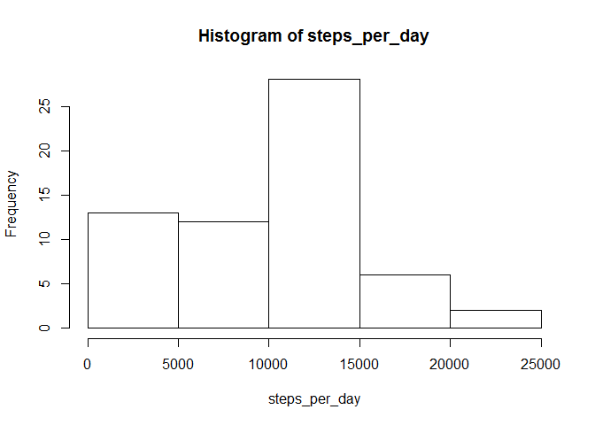
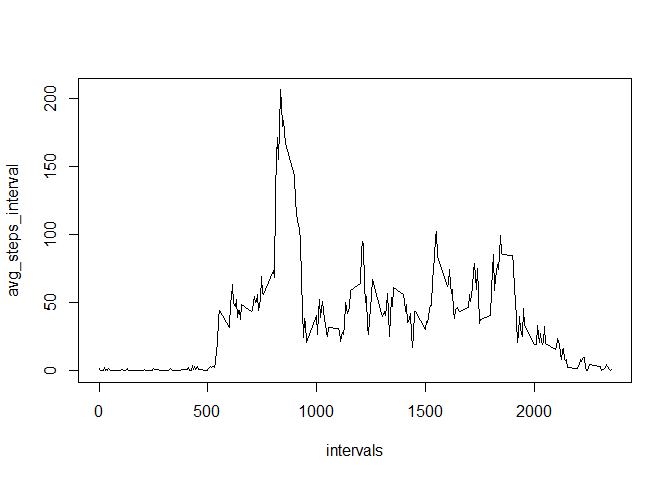
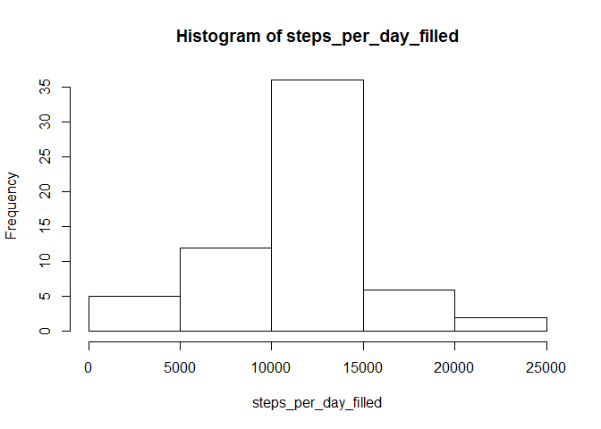
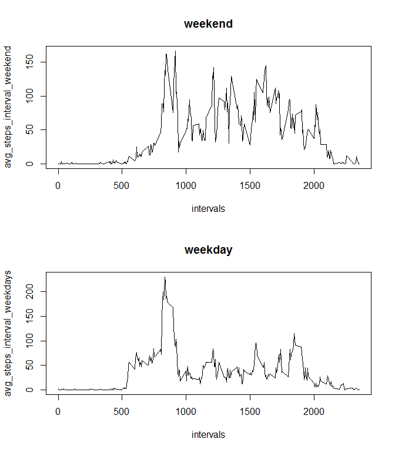

# Reproducible Research: Peer Assessment 1


## Loading and preprocessing the data

First, we will set the locale to make sure that the plots are in english, then we will set the directory to be the same as the source file and then we will load the data into a Data Frame. We'll also configure the plots to be on one line and column.


```r
Sys.setlocale("LC_TIME", "English")
```

```
## [1] "English_United States.1252"
```

```r
setwd("C:/Data_Science/Coursera/JHU/repdata-033/RepData_PeerAssessment1")
activity_data <- read.csv("activity.csv")
par(mfrow= c(1,1))
```


## What is mean total number of steps taken per day?

Now we will calculate the steps per day and plot a histogram of that


```r
steps_per_day <- tapply(activity_data$steps, activity_data$date, FUN=sum, na.rm=TRUE)
hist(steps_per_day)
```

 

Now, we will calculate the mean and the median of the steps taken per day


```r
mean(steps_per_day)
```

```
## [1] 9354.23
```

```r
median(steps_per_day)
```

```
## [1] 10395
```

## What is the average daily activity pattern?

Next, we will calculate the average steps by intervals and then find all unique intervals to use as the Y axis of our plot, and then plot the data. We'll also print the interval that contains the maximum number of steps.


```r
avg_steps_interval <- tapply(activity_data$steps, activity_data$interval, FUN=mean, na.rm=TRUE)
intervals <- unique(activity_data$interval)
plot(intervals, avg_steps_interval, type="l")
```

 

```r
avg_steps_interval[avg_steps_interval == max(avg_steps_interval)]
```

```
##      835 
## 206.1698
```

## Imputing missing values

Working with missing cases. First, we will calculate how many missing cases there are in the Data Frame. Next, we will fill the NAs with the mean value for that interval along all days.


```r
missing_cases <- nrow(activity_data) - nrow(activity_data[complete.cases(activity_data),])
print(missing_cases)
```

```
## [1] 2304
```

```r
filled_activity_data <- activity_data
for (interval in intervals) {
  filled_activity_data[(filled_activity_data$interval == interval) & is.na(filled_activity_data$steps),1] <- mean(filled_activity_data[filled_activity_data$interval == interval,1], na.rm=TRUE)
}
```

We will now use the completed data to find the sum of steps taken by day, make a histogram of it, and calculate the mean and median.


```r
steps_per_day_filled <- tapply(filled_activity_data$steps, filled_activity_data$date, FUN=sum, na.rm=TRUE)
hist(steps_per_day_filled)
```

 

```r
mean(steps_per_day_filled)
```

```
## [1] 10766.19
```

```r
median(steps_per_day_filled)
```

```
## [1] 10766.19
```

## Are there differences in activity patterns between weekdays and weekends?

Now, we are going to create a new variable to indicate if a day is a weekday or a weekend. We will then subset the data to get two data frames, one with only weekend data and the other with weekday data. We will also calculate the average steps on each situation.


```r
filled_activity_data$weekday <- weekdays(as.Date(filled_activity_data$date), abbreviate = TRUE)
filled_activity_data[filled_activity_data$weekday == "Sun" | filled_activity_data$weekday == "Sat", "weekday"] <- "weekend"
filled_activity_data[filled_activity_data$weekday != "weekend", "weekday"] <- "weekday"

weekend_filled_data <- filled_activity_data[filled_activity_data$weekday == "weekend",]
weekday_filled_data <- filled_activity_data[filled_activity_data$weekday == "weekday",]

avg_steps_interval_weekend <- tapply(weekend_filled_data$steps, weekend_filled_data$interval, FUN=mean, na.rm=TRUE)
avg_steps_interval_weekdays <- tapply(weekday_filled_data$steps, weekday_filled_data$interval, FUN=mean, na.rm=TRUE)
```

Finally, we will configure the plot to be multi panel and generate a plot of steps taken by interval on weekend and weekdays


```r
par(mfrow= c(2,1))

plot(intervals, avg_steps_interval_weekend, type="l", main="weekend")
plot(intervals, avg_steps_interval_weekdays, type="l", main="weekday")
```

 
